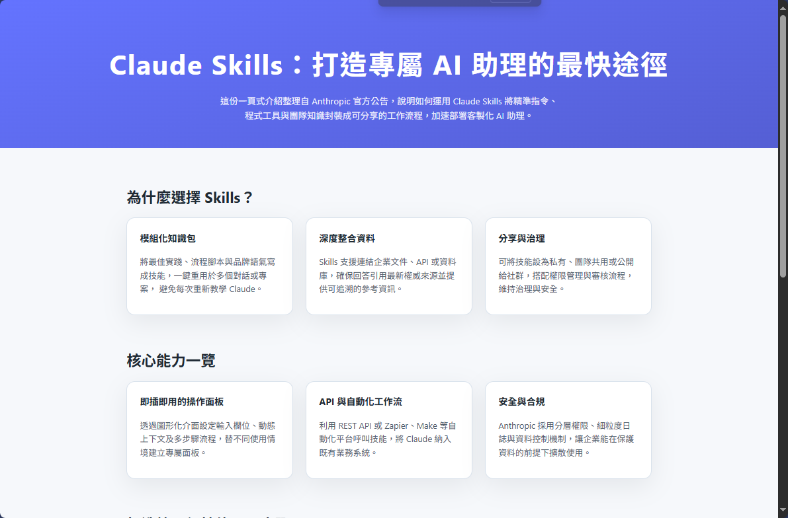

# ClaudeSkills
Claude Skills 是 Anthropic 在 Claude 上提供的一種「模組化技能系統」，本質上是一組打包好的「給 AI 用的 SOP＋資源＋程式碼」，讓 Claude 能在需要時自動載入，強化處理特定任務的能力，例如文件處理、資料分析或公司內部專屬流程。



# OpenSpec 初始化專案
Node.js >= 20.19.0 - Check your version with node --version
```bash
openspec init
```
選 Codex

# 開始 Vibe Coding - Codex
執行 codex /init

# PROMPT
```bash
依據 https://www.anthropic.com/news/skills 的內容的彙整製作一頁式的介紹說明網頁，並幫我填寫 project.md 與 AGENTS.md 的內容，網頁風格請參考 STYLE.md。
```

# 執行專案
於瀏覽器開啟 docs/index.html。